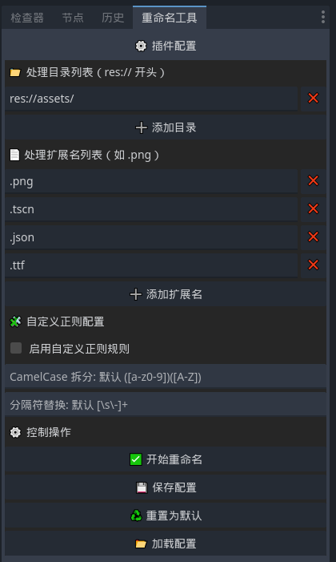

# RenameTool - Godot 插件

> ✂️ 批量重命名资源文件，统一格式风格，提升项目整洁度。

## ✨ 插件功能

RenameTool 是一个面向 Godot 引擎（支持 C#）的编辑器插件，提供可视化界面，用于批量重命名指定目录下的资源文件，统一命名格式（如转为 `snake_case`）。



插件支持：

- ✅ 多目录批量处理（`res://` 路径）
- ✅ 指定处理的文件扩展名（如 `.png`, `.tscn`, `.json`）
- ✅ 自动将文件名转为 `snake_case`
- ✅ 支持自定义正则拆分与替换规则（如 CamelCase 拆分、分隔符替换）
- ✅ 配置保存与加载，支持持久化
- ✅ 图形化界面，集成到 Godot 编辑器

---

## 🛠 安装方式

### 方法一：本地安装

1. 将本插件文件夹复制到你的项目目录中：

    ```
    your_project/
    └── addons/
        └── rename_tool/
            ├── RenameTool.cs
            ├── RenameToolPanel.cs
            ├── config.cfg
            └── plugin.cfg
    ```

2. 在 Godot 编辑器中打开项目：
    - 前往 **项目 > 项目设置 > 插件**
    - 启用 `RenameTool`

### 方法二：从 GitHub 安装

```bash
git clone https://github.com/your-name/godot-rename-tool.git
mv godot-rename-tool/addons/rename_tool your_project/addons/
```

---

## 🚀 使用说明

1. 启用插件后，右侧会出现 `RenameTool` 面板；
2. 设置要处理的目录路径（以 `res://` 开头）；
3. 指定扩展名（如 `.tscn`、`.png`）；
4. 点击 ✅“开始重命名” 即可；
5. 可选：启用“自定义正则”高级配置。

> 所有配置可保存到 `addons/rename_tool/config.cfg`，支持后续加载或重置。

---

## 📁 配置文件说明

默认配置保存在：

```
res://addons/rename_tool/config.cfg
```

配置字段包括：

```ini
[settings]
dirs=["res://assets/"]
extensions=[".png", ".tscn", ".json"]
camel_case_regex="([a-z0-9])([A-Z])"
separator_regex="[\s\-]+"
custom_regex_enabled=false
```

---

## 💡 开发说明

插件基于 C# 开发，使用 Godot Mono API。主类为：

- `RenameTool.cs`：插件入口，实现 `EditorPlugin`
- `RenameToolPanel.cs`：插件界面逻辑，实现批量处理和配置管理

---

## 🧪 兼容性

- ✅ Godot 4.x
- ✅ C#

---

## 📜 许可证

本插件使用 [Apache License 2.0](LICENSE)。

---

## 🙋‍♀️ 贡献与反馈

欢迎 issue / PR！你可以：

- ⭐ Star 本项目
- 📦 提交新功能建议
- 🐞 报告 bug
- 📝 优化界面布局或翻译文案

---
